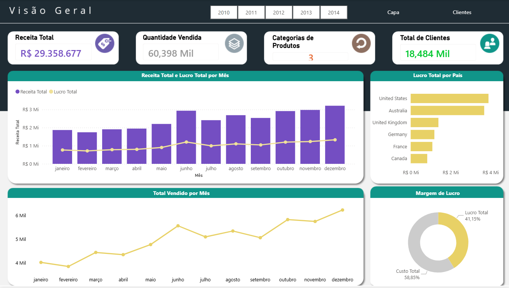
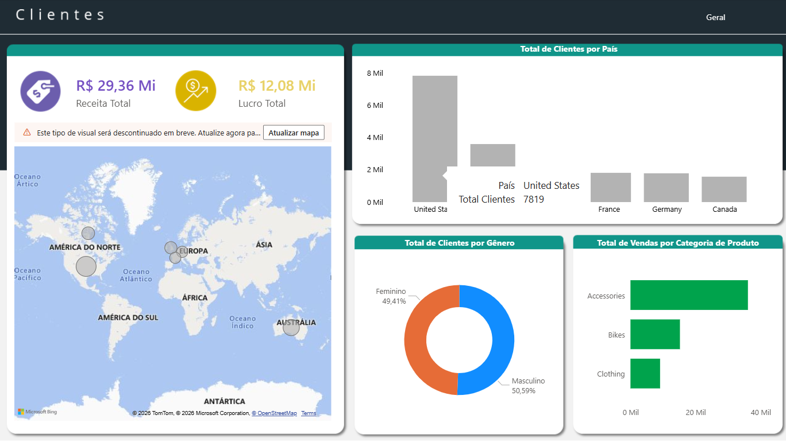

# Adventure Works Internet Sales BI

## 🖼️ Visão Geral do Projeto

---

## 📊 Contexto do Projeto
Projeto de **Business Intelligence** com foco na integração entre **SQL Server** e **Power BI**, utilizando a base de dados **AdventureWorks 2014** para análise de vendas via internet.

O projeto simula um cenário real de BI, no qual os dados são tratados e consolidados no banco de dados relacional, permitindo que o Power BI consuma informações prontas para análise e visualização.

---

## 🎯 Objetivo
- Centralizar os dados de vendas em uma *view* única no SQL Server  
- Facilitar o consumo analítico no Power BI  
- Analisar desempenho de vendas, clientes e lucratividade  
- Apoiar a tomada de decisão por meio de indicadores claros  

---

## 🛠️ Tecnologias Utilizadas
- SQL Server  
- T-SQL  
- Power BI  
- Base de dados AdventureWorks 2014  

---

## 🗂️ Modelagem dos Dados
A solução foi construída a partir da tabela fato **FactInternetSales**, com integração às dimensões:

- DimProduct  
- DimProductSubcategory  
- DimProductCategory  
- DimCustomer  
- DimGeography  

A partir dessas tabelas, foi criada a *view* **RESULTADOS_ADW**, responsável por consolidar dados de pedidos, produtos, clientes, localização geográfica e métricas financeiras.

---

## 📈 Indicadores Analisados

### Aba Geral

- Receita Total  
- Quantidade Vendida  
- Total de Categorias de Produtos  
- Quantidade de Clientes  
- Receita Total e Lucro Total por Mês  
- Margem de Lucro  
- Quantidade Vendida por Mês  
- Lucro por País  

---

### Aba Clientes

- Vendas por País  
- Clientes por País  
- Vendas por Gênero  
- Vendas por Categoria de Produto  

---

## 🔎 Principais Insights
- Os Estados Unidos concentram a maior parte da receita e do lucro, sendo o principal mercado da empresa  
- A categoria *Bikes* apresenta o maior impacto no faturamento e no ticket médio  
- As vendas possuem comportamento sazonal, com maior volume nos últimos meses do ano  
- A distribuição de vendas por gênero é equilibrada, sem distorções relevantes  

---

## 📌 Escopo da Análise
- Ano analisado: **2013**  
- Apenas vendas realizadas via internet  

---

## 📁 Arquivos do Projeto
- `sql-server-view` → Criação da view no SQL Server  
- `sql-server-powerbi-sales-dashboard` → Dashboard interativo no Power BI  

---

## ✅ Conclusão
O projeto demonstra a aplicação prática de **SQL Server para modelagem e consolidação de dados** e o uso do **Power BI como ferramenta de visualização analítica**, seguindo um fluxo comum em ambientes corporativos de Business Intelligence.
